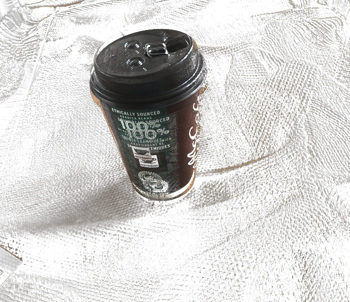

# Triangulation-Matting-with-Patch-Matching
Discovering an automatic image matting methodology by combining Triangulation Matting and Patch Matching.


## Introduction
A. R. Smith and J. F. Blinn proposed a tecnique which they refer to as Triangulation Matting. This technique requires four images as input for extracting the foreground object. It takes two images of the object, but with different backgrounds, and two more images that are only the two backgrounds but without the foreground object. Since triangulation matting works by removing the known backgrounds of the two compostive images and then comparing them, a pixel where the two resulting images don't have in common would receive a small alpha value indicating that it is not part of the foreground obejct. This would become a shorthand of the technique since the position and orientation of the object in the two different background images are required to be strictly the same, which is hard to achieve.



In order to allow small differences of the object between the two images, I am adding the patch matching algorithm. Therefore rather than simply comparing two pixels, for every pixel on the source image, look for patches near the corresponding patch on the target image that has the most similarities to the patch on source image, and we'll compare the center pixel of those two patches. 


## Usage
```python
python viscomp.py --matting \
           --backA cup/backA.jpg \
           --backB cup/backB.jpg \
           --compA cup/compA.jpg \
           --compB cup/compB.jpg \
           --alphaOut cup/alpha.tif \
           --colOut cup/col.tif

python viscomp.py --compositing \
	                --alphaIn cup/alpha.tif \
	              	--colIn cup/col.tif \
	                --backIn cup/background.jpg \
	                --compOut cup/comppp.jpg
```


## Result
see more results here:
[report](report.pdf)
